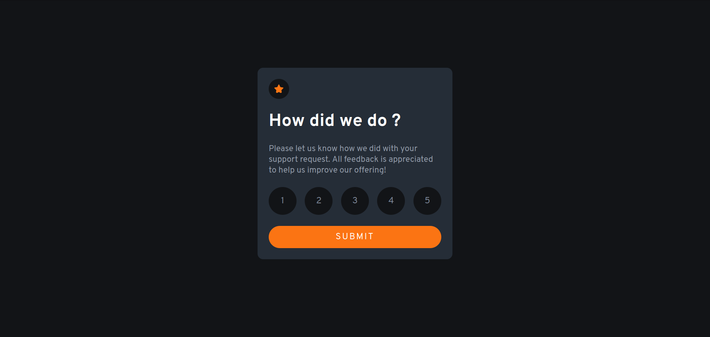

## Table of contents

- [Overview](#overview)
  - [The challenge](#the-challenge)
  - [Screenshot](#screenshot)
  - [Links](#links)
- [My process](#my-process)
  - [Built with](#built-with)
- [Author](#author)

## Overview

### The challenge

Users should be able to:

- View the optimal layout for the app depending on their device's screen size
- See hover states for all interactive elements on the page
- Select and submit a number rating
- See the "Thank you" card state after submitting a rating

### Screenshot

### Links

- Solution URL: [https://github.com/sanris12/interactive-rating-component-main](https://github.com/sanris12/interactive-rating-component-main)
- Live Site URL: [https://interactive-rating-component-main-taupe.vercel.app](https://interactive-rating-component-main-taupe.vercel.app)

## My process

### Built with

- html
- css
- javascript

## Author

- github - [sanris12](https://github.com/sanris12)
- Frontend Mentor - [@sanris12](https://www.frontendmentor.io/profile/sanris12)
